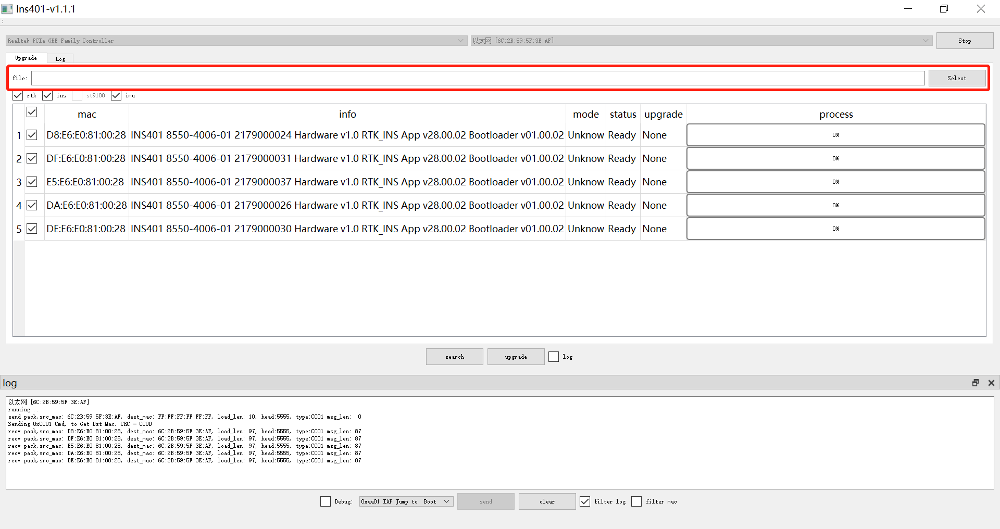
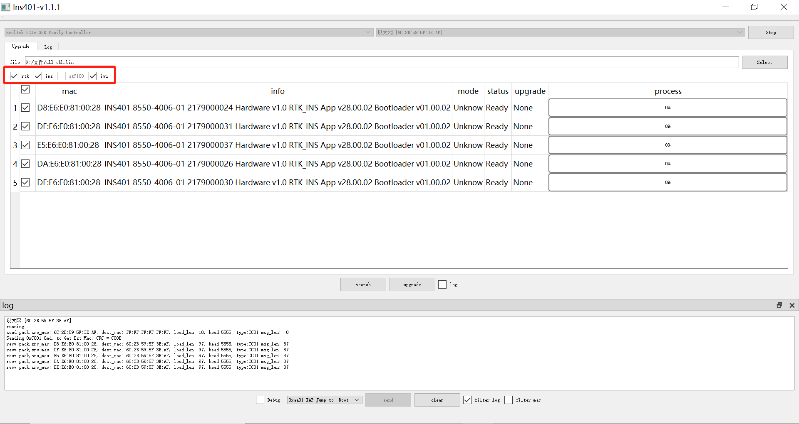
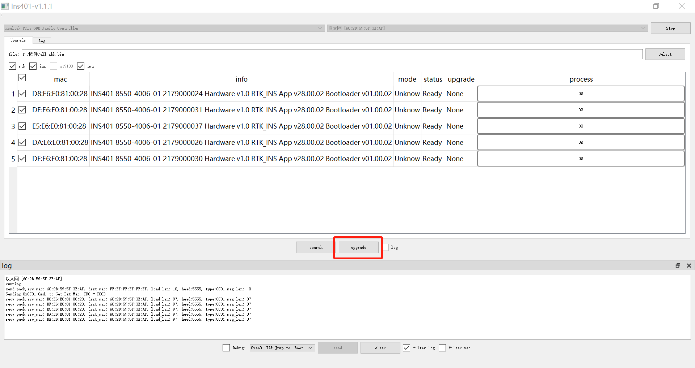
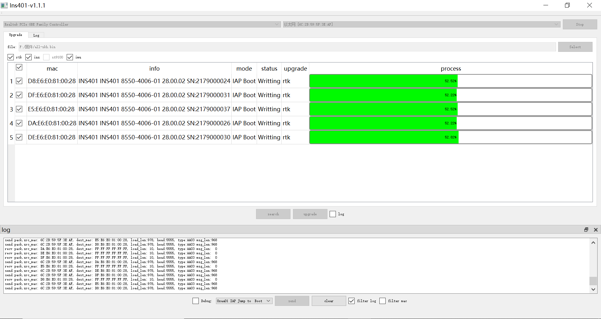
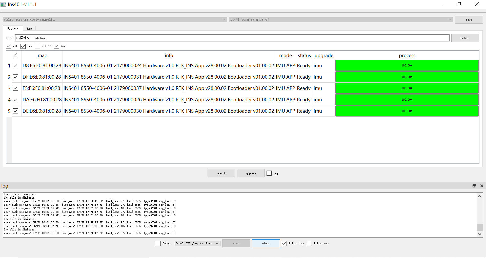

[中文](README.md)

# Ins401.exe instructions

1. Select the network card and Ethernet mac address, click [Listen] to start monitoring the network card.

2. Click [search] to search for available ins401 devices.

3. Select the firmware file path.

4. Check the firmware app that needs to be upgraded.

5. Click [upgrade] to start upgrading the firmware.

6. Wait for the firmware upgrade to complete.

7. When the progress bar of each app of each device reaches 100%, the [upgrade] button becomes available again, indicating that the firmware upgrade is complete.

