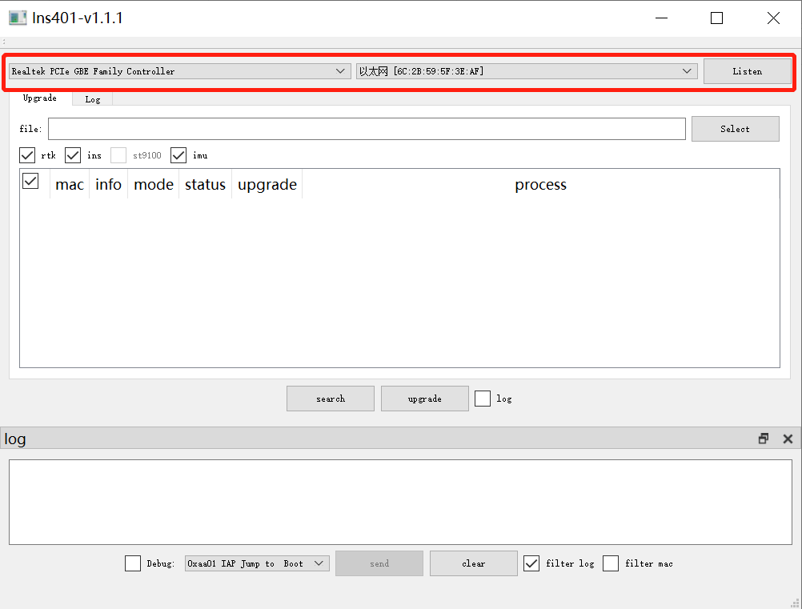
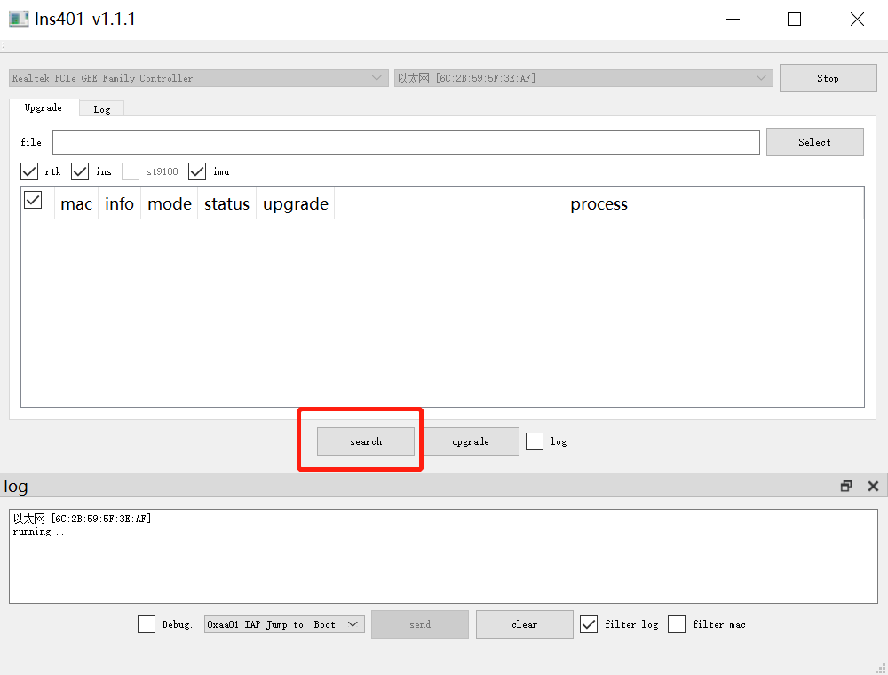
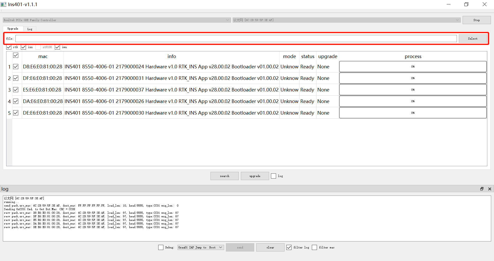
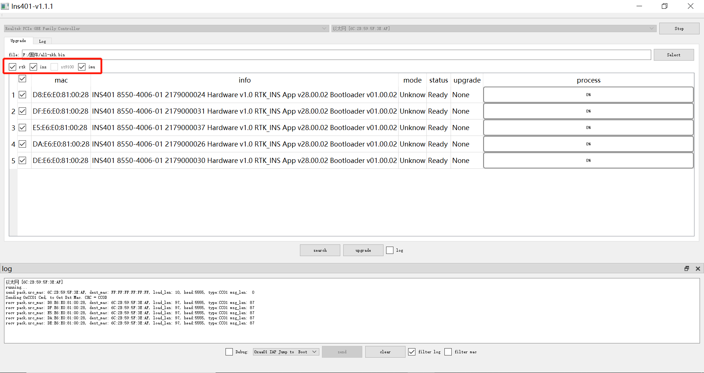
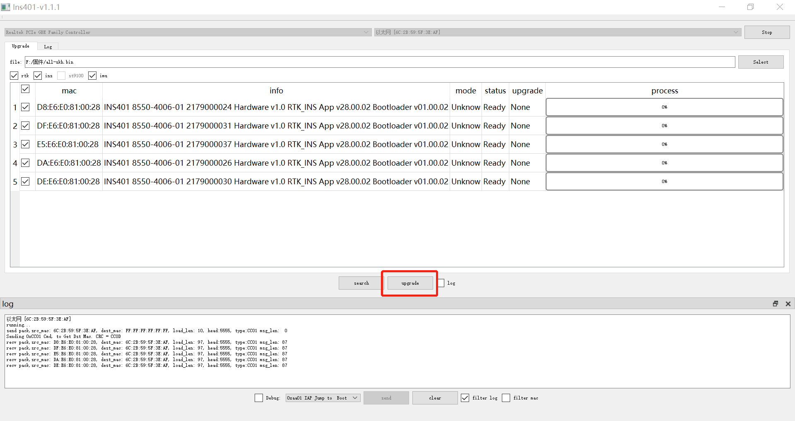
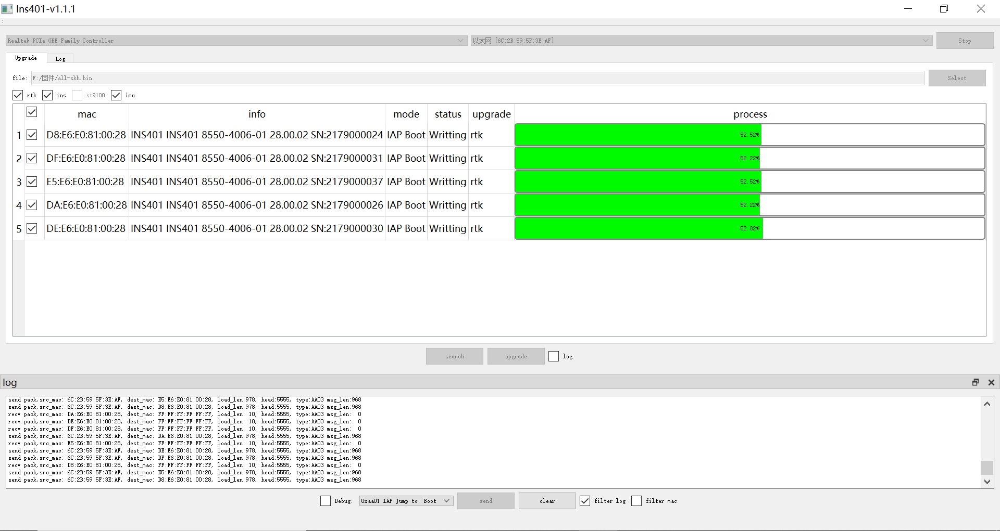
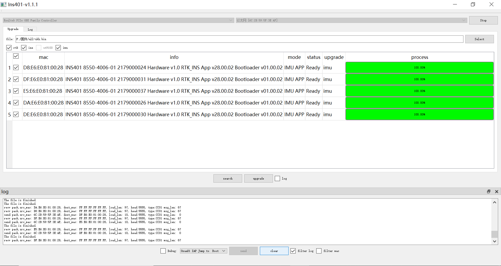

[English](README-En.md)

# Ins401.exe 使用说明

1. 选择网卡和以太网mac地址，点击【Listen】开始监听该网卡。

2. 点击【search】搜索可用的ins401设备。

3. 选择固件文件路径。

4. 勾选需要升级的固件app。

5. 点击【upgrade】开始升级固件。

6. 等待固件升级完成。

7. 等到每个设备的每个app的进度条到达100%，【upgrade】按钮再次变为可用状态，表示固件升级完成。

