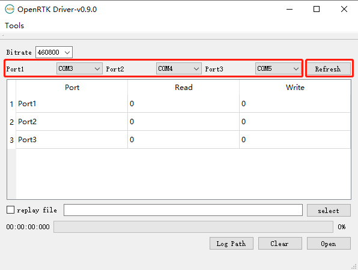
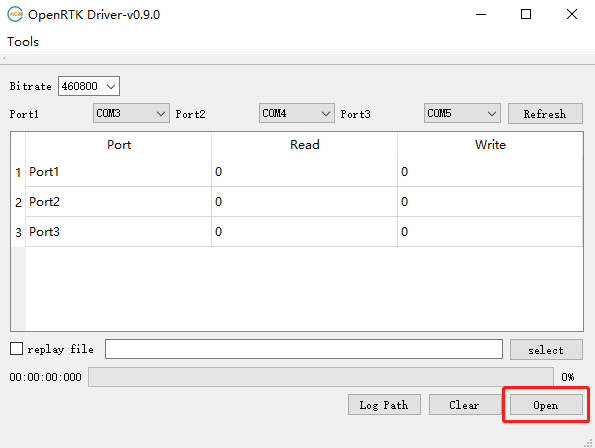
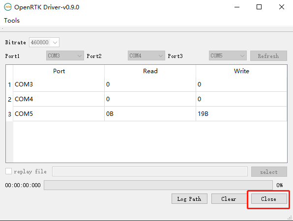
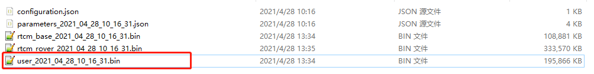
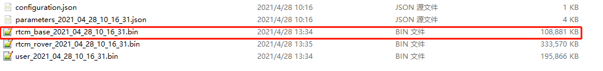
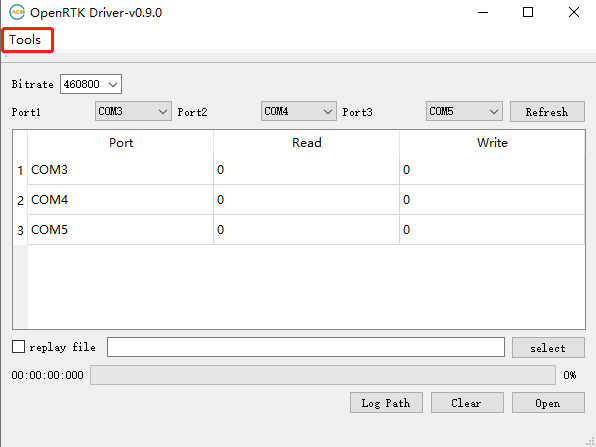
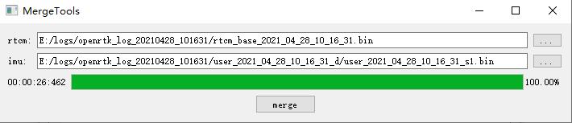
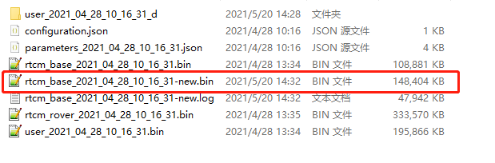

[中文](README.md)

# OpenRTK Dirver Instructions

## Burn firmware

1. Connect OpenRTK330LI to the computer with a usb cable.

2. Burn the firmware to OpenRTK330LI.

## Data collection

(You can also use python-openimu to collect data.)

1. Open OpenRTK_Dirver.exe and select the three serial ports corresponding to OpenRTK330LI. If the serial ports are not displayed, you can click [Refresh] to try.

2. Click [Open] without checking [replay file] to collect the data of OpenRTK330LI into a local file.

3. Click [Log Path] to open the collection folder. The three files in the folder correspond to the data collected by the three serial ports.

4. After a period of time, click [Close] to stop collecting data.

5. Serial_1_COMX_XXXX-XX-XX_XX-XX-XX.bin collected by the first serial port is the result data and IMU raw data file,if you use python-openimu to collect data, this file same as the user_XXXX-XX-XX-XX_XX-XX-XX.bin file collected by python-openimu.

6. Serial_3_COMX_XXXX-XX-XX_XX-XX-XX.bin collected by the third serial port is the original rtcm data file,if you use python-openimu to collect data, this file same as the rtcm_base_XXXX-XX-XX_XX-XX-XX.bin file collected by python-openimu.

## Decode data

1. Click the [Tools] menu and select [Decoder] to open the [Decoding Tool].

2. Select [openrtk], and select the file collected by the first serial port, and click [decode].

3. The files in the folder are the decoded data, and the files with the suffix _s1.bin are the raw data of imu.

## Merge data

1. Click the [Tools] menu, select [Merger] to open [Merge Tool].

2. The rtcm file selects the file collected by the third serial port, and the imu file selects the imu raw data decoded before.

3. Click [merge] to merge the files into one raw data file.

## Replay

1. Power off and restart OpenRTK330LI, you need to restart the device every time before replaying data.

2. Select the three serial ports corresponding to OpenRTK330LI.

3. Check [replay file], and select the merged raw data file.

4. Click [Open] to start replay.

5. The first serial port still outputs the result data file, you can use [Decode Tools] to decode it.

