[English](README-En.md)

# OpenRTK Dirver 使用说明

## 烧固件

1. 用usb数据线将OpenRTK330LI和电脑连接。

2. 首先将openrtk_replay.bin固件烧录到OpenRTK330LI中。

3. 该固件与正常版本固件的计算和采集功能相同可以作为正常本版固件使用，与正常固件相比增加了以下功能： 
  - 采集的rtcm数据已经将rover站数据和base站数据按照时序合并。
  - 增加了回放模式，与OpenRTK Dirver配合使用可以从串口输入历史数据重新计算。

## 采集数据
(也可以使用python-openimu采集数据)

1. 打开OpenRTK_Dirver.exe,选择OpenRTK330LI对应的三个串口，如果没有显示串口可以点击【Refresh】试试。

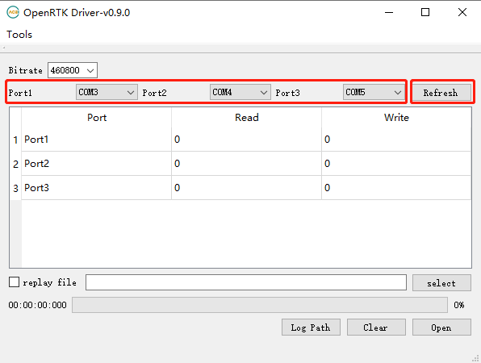

2. 在未勾选【replay file】的情况下点击【Open】可以将OpenRTK330LI的数据采集到本地文件中。

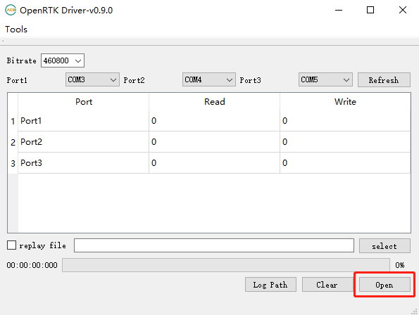

3. 点击【Log Path】可以打开采集文件夹，文件夹中的三个文件分别对应三个串口采集的数据。

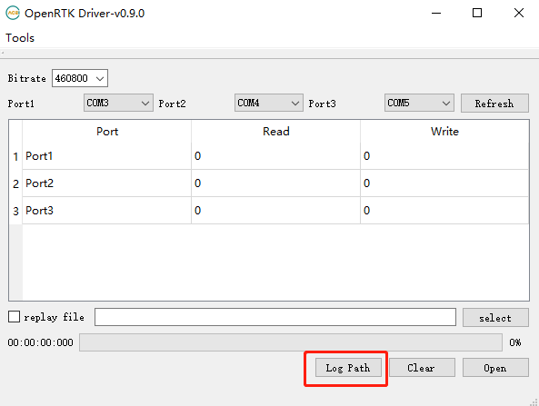
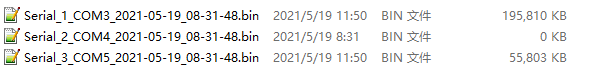

4. 一段时间后点击【Close】可以停止采集数据。

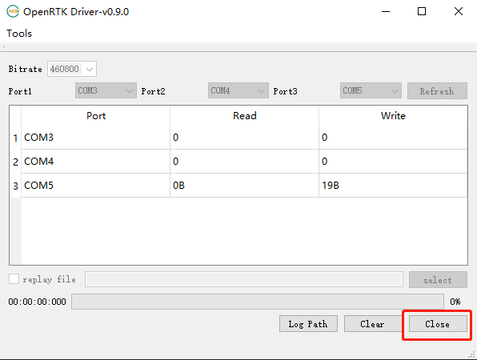

5. 其中第一个串口采集的Serial_1_COMX_XXXX-XX-XX_XX-XX-XX.bin是结果数据和IMU原始数据文件，如果使用python-openimu采集数据，该文件对应python-openimu采集的user_XXXX-XX-XX_XX-XX-XX.bin文件。

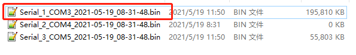
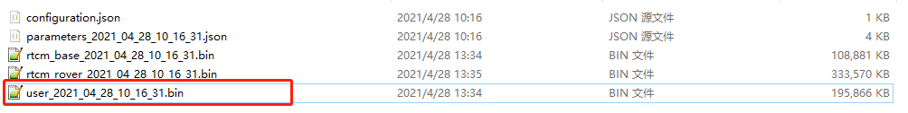

6. 第三个串口采集的Serial_3_COMX_XXXX-XX-XX_XX-XX-XX.bin是rtcm原始数据文件，如果使用python-openimu采集数据，该文件对应python-openimu采集的rtcm_base_XXXX-XX-XX_XX-XX-XX.bin文件。

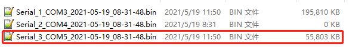
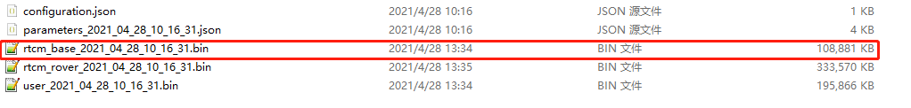

## 解码数据

1. 点击【Tools】菜单，选择【Decoder】打开【Decode Tools】。

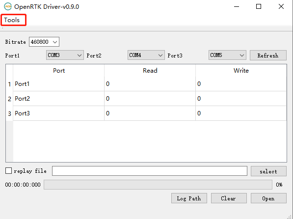

2. 选择【openrtk】，并且选择第一个串口采集的文件，点击【decode】。

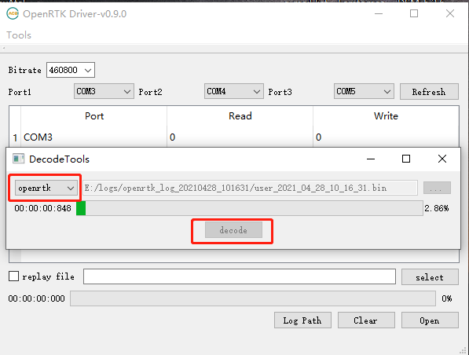

3. 文件夹中是解码后的数据，其中后缀为_s1.bin的文件是imu的原始数据。

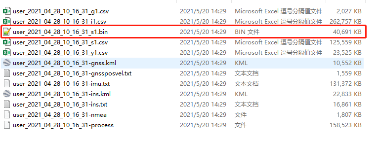

## 合并数据

1. 点击【Tools】菜单，选择【Merger】打开【Merge Tool】。

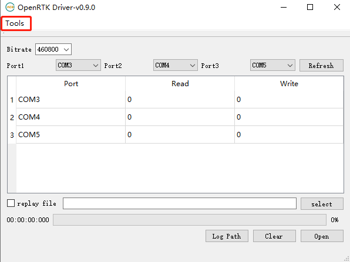

2. rtcm文件选择第三个串口采集的文件，imu文件选择之前解码出的imu原始数据。

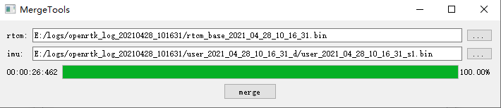

3. 点击【merge】，合并文件得到合并后的rtcm+imu原始数据文件。

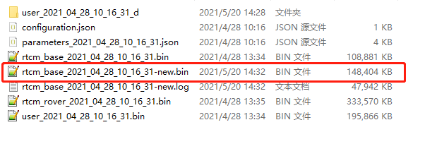

## 重播数据

1. 断电重启OpenRTK330LI,每次重播数据前都需要重启一下设备。

2. 选择OpenRTK330LI对应的三个串口。

3. 勾选【replay file】，并且选择合并后的原始数据文件。

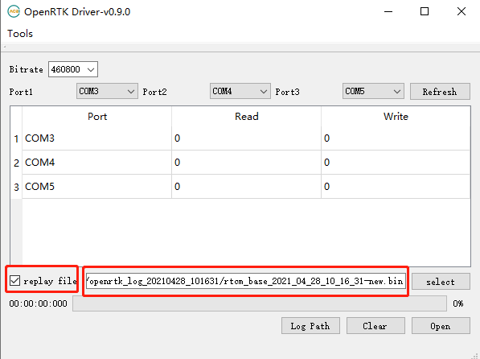

4. 点击【Open】开始重播。

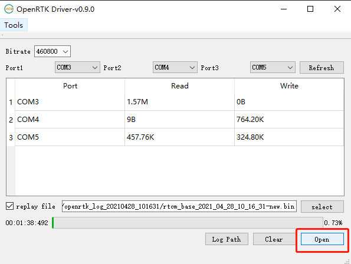

5. 第一个串口任然输出结果数据数据文件，可以使用【Decode Tools】进行解码。

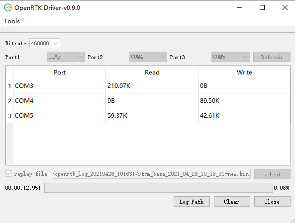
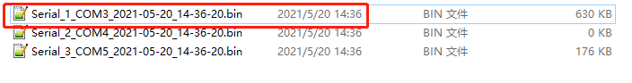

