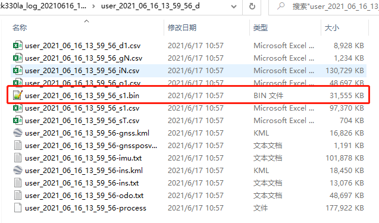
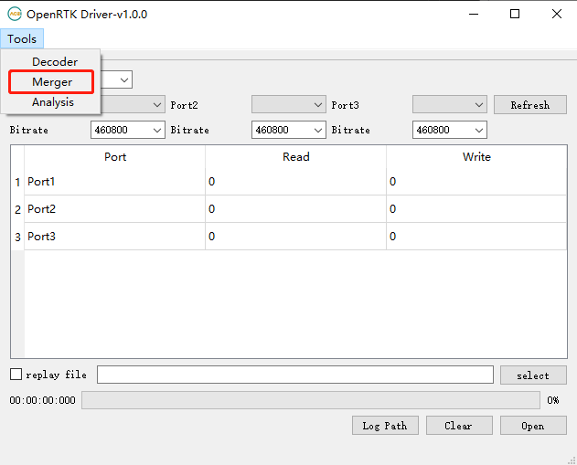
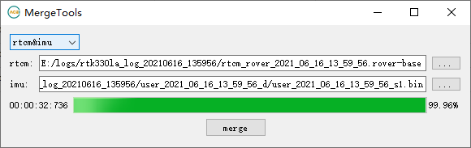
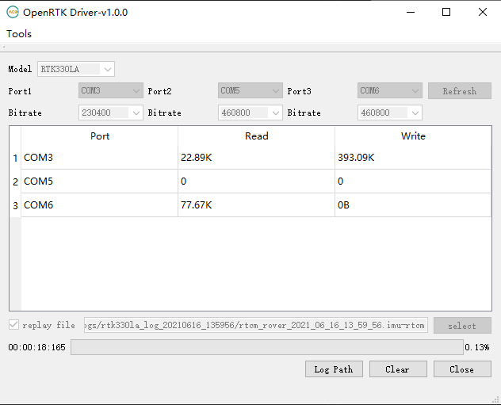

# Replay on RTK330LA using OpenRTK Dirver

## Prepare the data

1. The data to be prepared includes rover and base rtcm data and user output files.

## Decoded data

1. Click [Tools] and select [Decoder] to open the Decoder tool.

2. If it is OpenRTK330Li data, select [openrtk-user], if it is RTK330LA data or inceptio data, select [openrtk-inceptio], select the file, and click [decode] to decode the data.

3. The user folder is generated after decoding, and you can see the decoded files after entering the user folder, including the imu data files that need to be used.

## Merge data

1. Click [Tools] menu, select [Merger] to open [Merge Tool].

2. Select [reover&base], select rover and base data, and click [merge] to merge the files to generate mixed data of rover and base.

3. Select [rtcm&imu], select the rover-base mixed data just generated and the decoded imu data file, and click [merge] to merge the files to generate mixed data of imu and rtcm. This is the final replay file.

## Burn firmware

1. Connect RTK330LA to the computer with a usb data cable.

2. Burn the RTK330LA_replay.bin firmware to RTK330LA.

3. The abnormal version of this firmware can only be used with relpay at present.

## Replay data

1. [Model] is selected as [RTK330LA].

2. Choose the three serial ports corresponding to RTK330LA, generally the first serial port, the third serial port and the fourth serial port.

3. Baud rate selection [230400], [460800] and [460800].

4. Check [replay file], and select the merged replay file.

5. Click [Open] to start the replay.

6. The first serial port output result data file, you can use [Decode Tools] to decode it.