# 使用 OpenRTK Dirver 在 RTK330LA 上重播

## 准备数据

1. 需要准备的数据包括rover和base的rtcm数据和user输出文件。

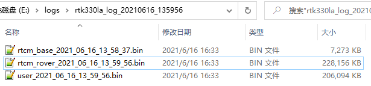

## 解码数据

1. 点击【Tools】选择【Decoder】，打开Decoder工具。

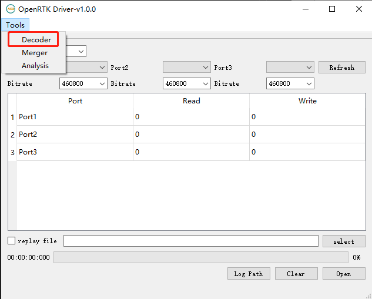

2. 如果是OpenRTK330Li的数据选择【openrtk-user】，如果是RTK330LA的数据或者inceptio的数据选择【openrtk-inceptio】，选择文件，点击【decode】解码数据。

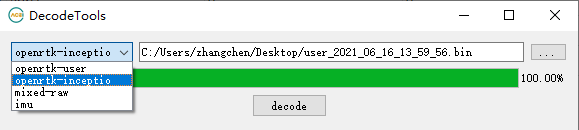

3. 解码后生成user文件夹，进入user文件夹可以看到解码后的文件，其中包括需要用到的imu数据文件。

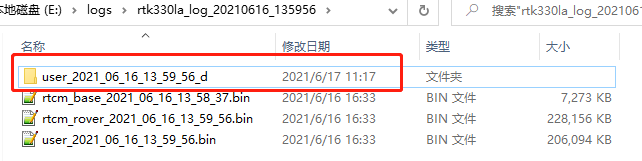

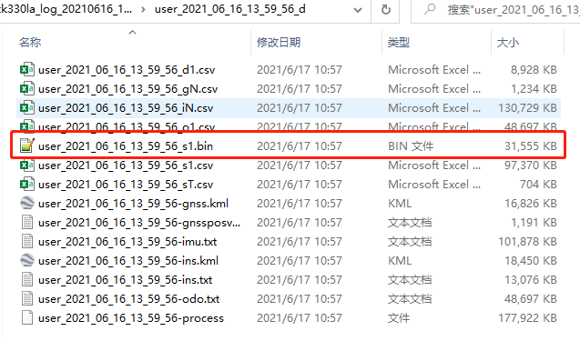

## 合并数据

1. 点击【Tools】菜单，选择【Merger】打开【Merge Tool】。

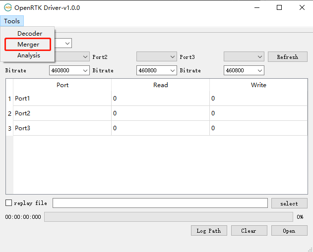

2. 选择【reover&base】，选择rover和base数据，点击【merge】合并文件，生成rover和base的混合数据。

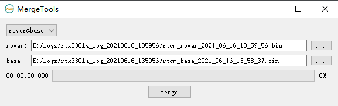

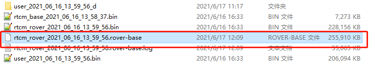

3. 选择【rtcm&imu】，选择刚刚生成的rover-base混合数据加上解码得到的imu数据文件，点击【merge】合并文件，生成imu和rtcm的混合数据数据。这就是最终需要的replay文件。

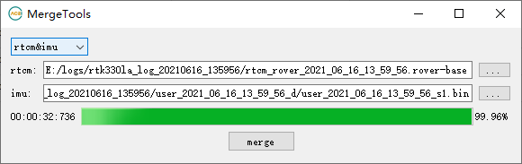

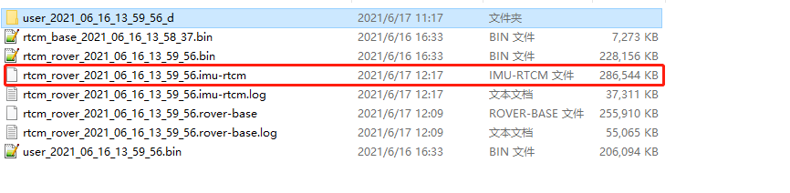

## 烧固件

1. 用usb数据线将RTK330LA和电脑连接。

2. 将RTK330LA_replay.bin固件烧录到RTK330LA中。

3. 该固件非正常版本当前只能用于relpay。

## 重播数据

1. 【Model】选择为【RTK330LA】。

2. 选择RTK330LA对应的三个串口，一般为第一个串口第三个串口和第四个串口。

3. 波特率选择【230400】，【460800】和【460800】。

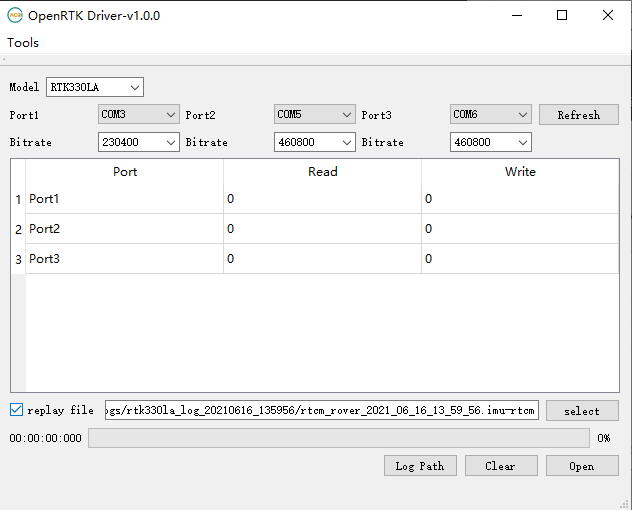

4. 勾选【replay file】，并且选择合并后的replay文件。

5. 点击【Open】开始重播。

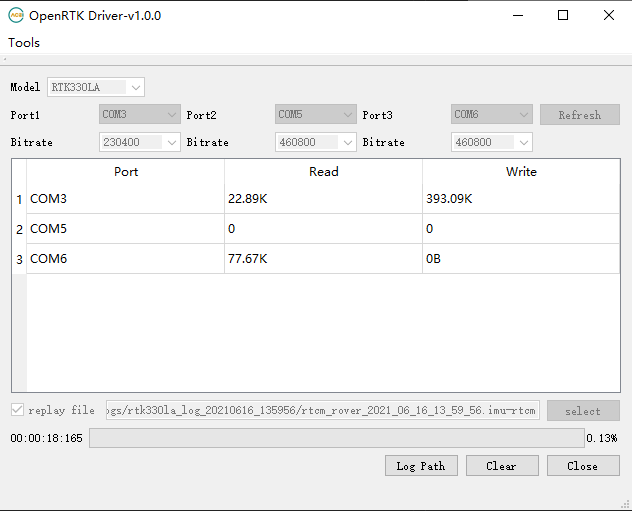

6. 第一个串口输出结果数据文件，可以使用【Decode Tools】进行解码。