[中文](README.md)

# Openlink instructions

OpenLink is a tool used to forward and save data. It can connect any input stream and any output stream, and can save the data of any stream. Any of [Input-1],[Input-2],[Input-3] received data can be forwarded to [Output-1],[Output-2],[Output-3], and any of [Output-1],[Output-2],[Output-3] received data also can be forwarded to [Input-1],[Input-2],[Input-3].

Openlink download：<https://github.com/Aceinna/openrtk_core/releases>

## 1. Saving data from ntrip client by Openlink

1.1. click [Select] select a path to save stream files.

1.2. heck [input-1] and click the [config] button below to open the [input-1] data flow configuration dialog.

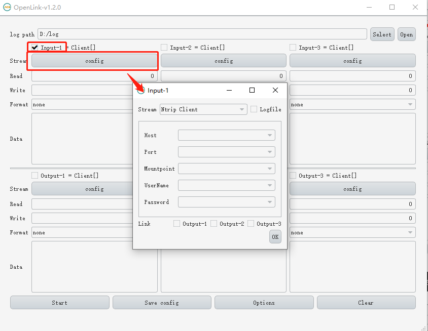

1.3. In the [input-1] dialog, select [stream] as [ntrip client], fill in the corresponding parameters, check [logfile], and then click [OK].

1.4. Click the [start] button to start collecting data.

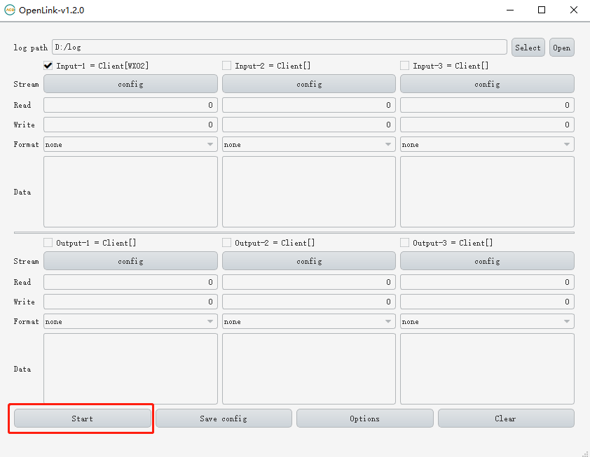

1.5. [format] Select hex to see the hexadecimal representation of the received data. Click the [open] button to find the data file in the resource manager.

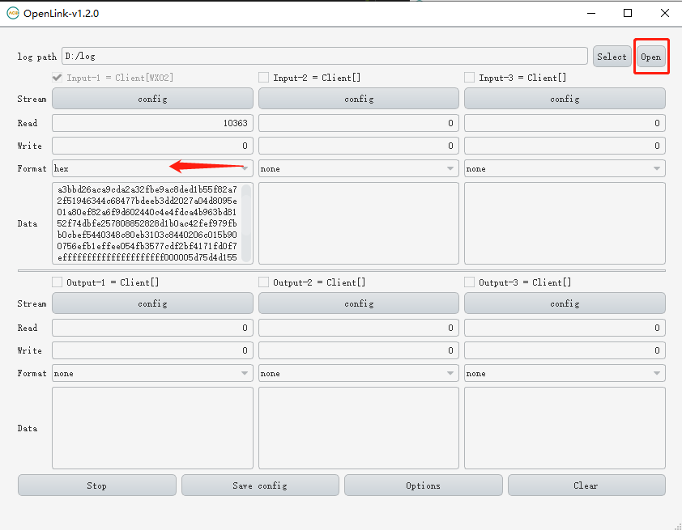

1.6. The saved data file is displayed in Explorer.

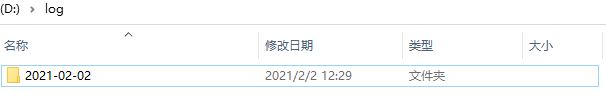

1.7. Other data streams can collect data in the same way. Six data streams can collect data at the same time.

1.8. Open explorer to see the saved data file.

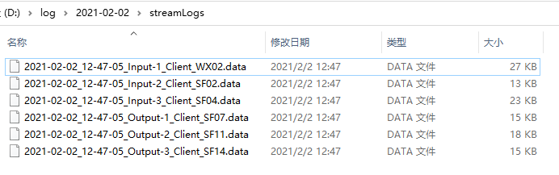

## 2.Saving data from serial port by Openlink

Other steps are the same as saving ntrip data. In the step 1.3. select [serial port], and select corresponding [port], [bitrate] and [bytesize]

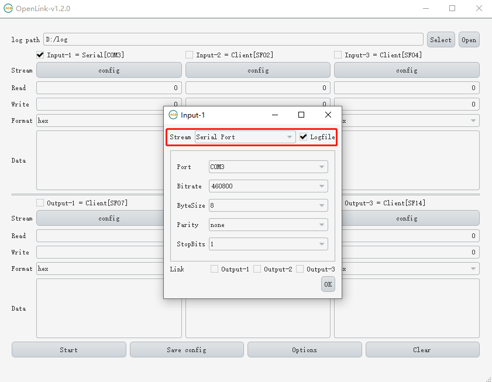

2.2. Click [start] to collect data from serial.

2.3. Similarly, six data streams can be connected to six serial ports to collect data at the same time.It can also collect ntrip and serial data at the same time.

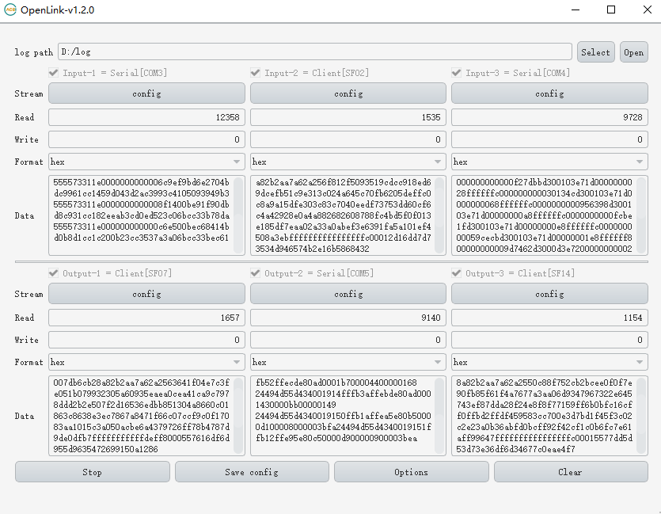

2.4. Open explorer to see the saved data file.

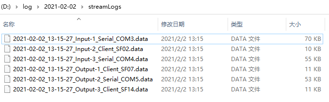

## 3.Forwarding data by OpenLink

3.1. Check [input-1] and configure [input-1] as [ntrip client], [link] Check [output-1] and the data will be forwarded to the data stream of [output-1]. If necessary, you can also check other [output] to forward to multiple data streams. If you need to save the data received by [ntrip client], you can check [logfile]

3.2. Check [output-1] and configure [output-1] as [serial port], select corresponding [port], [bitrate] and [bytesize]

3.3. Click [start] to forward the data

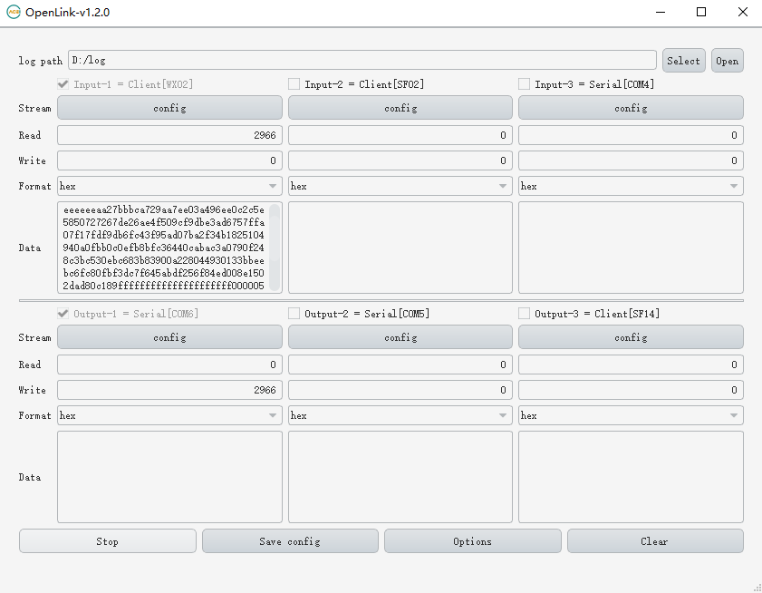

3.4. Similarly, you can forward the data of [serial port] to [ntrip caster], select [serial port] for [input-1], and check [output-1] for [link].

3.5. [output-1] select [ntrip caster].

3.6. Click [start] to forward [serial port] to [ntrip caster].

3.7. You can see that the new caster has been set up.

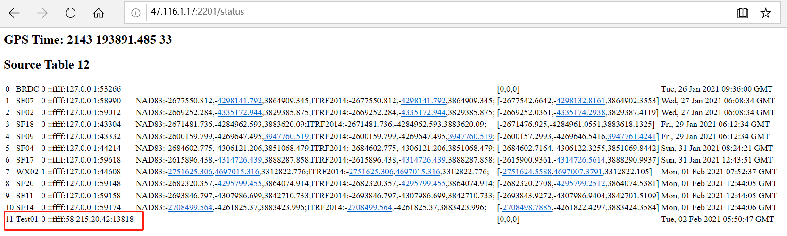

3.8. Other input and output streams can also be used in this way.

## 4. Setting up base station by OpenLink

4.1. In the same way as forwarding data, [input-1] selects [serial port], selects the serial port to output RTCM, and [link] checks [output-1].

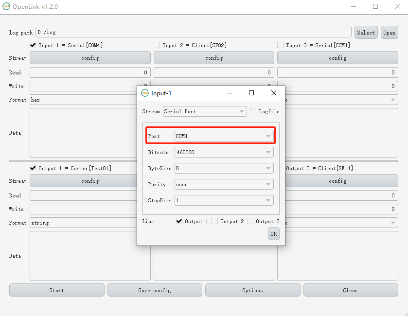

4.2. [output-1] select [ntrip caster]

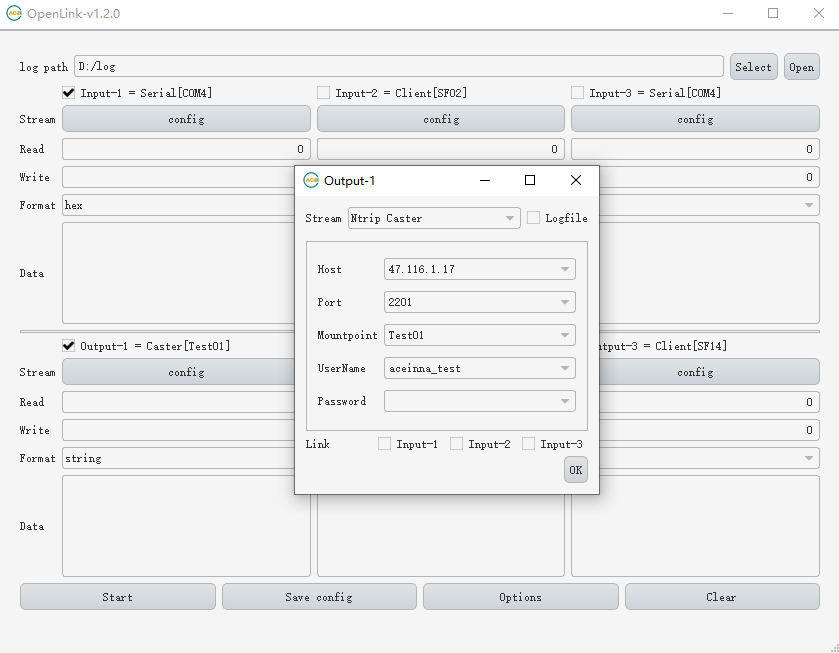

4.3. Click the [option] button to open the [option] dialog.

4.4. Check [station ID] and enter ID, select the format of station coordinates and enter coordinates, and click [OK] to close the dialog.

4.5. Click [start] to upload data to [ntrip caster] to build a site.

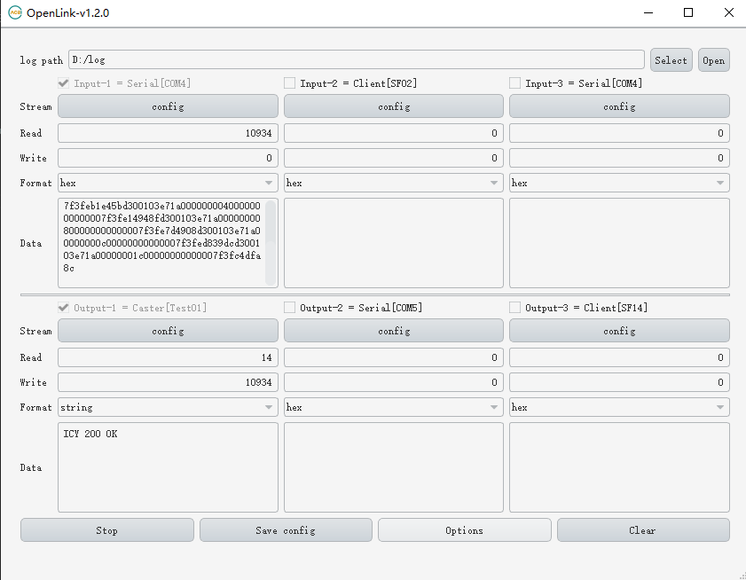

4.6. View the newly established base station on the website page.

## 5.Using OpenLink to read files to simulate real time data

5.1. Check [input-1], [stream] select [file], [freq] select according to file format, [format] select according to file format, [station] select [Rover], [file] Select rover station file, [link] Check [output-1].

5.2. Check [input-2], [stream] select [file], [freq] select according to file format, [format] select according to file format, [station] select [base], [file] Select base station file, [link] Check [output-2].

5.3. Check [output-1], select [ntrip caster] for [stream], and set [mountpoint] to a custom name [rovertest01].

5.4. Check [output-2], select [ntrip caster] for [stream], and set [mountpoint] to a custom name [basetest01].

5.5. Click [start] to read two files according to frequency and upload them to two [casters] synchronously.

5.6. View the two casters on the website page, and then you can use other tools to get the data of the two casters and calculating.

