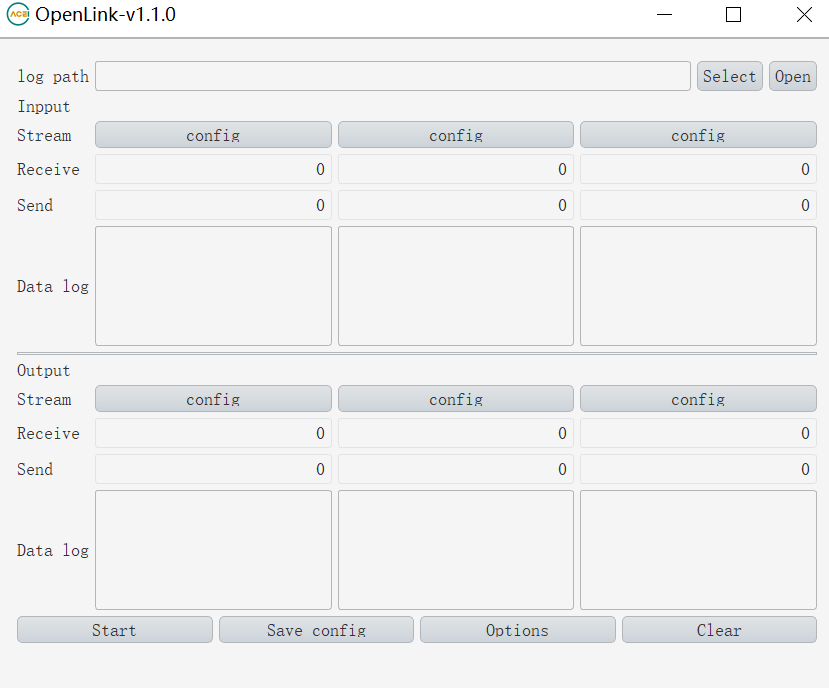
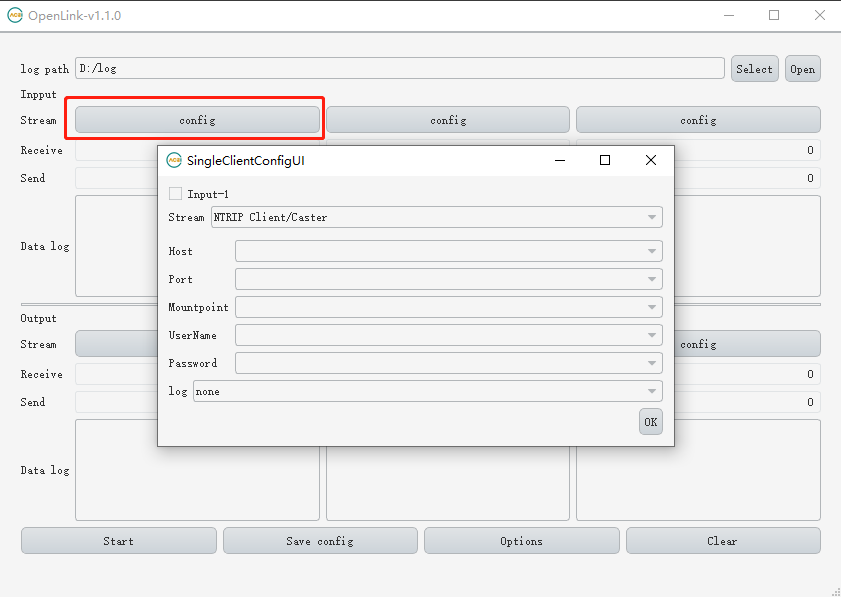
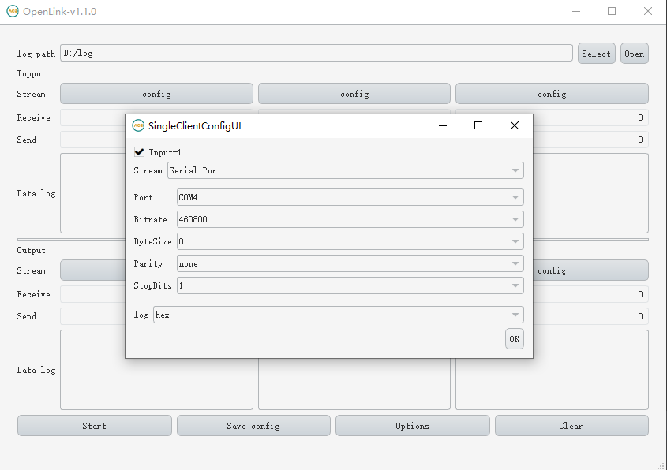
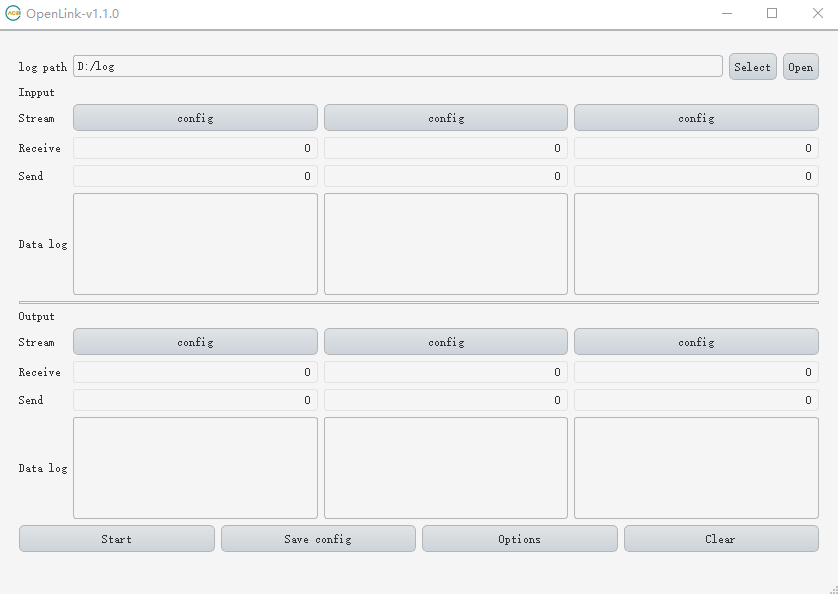
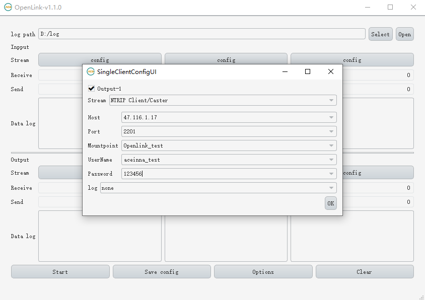
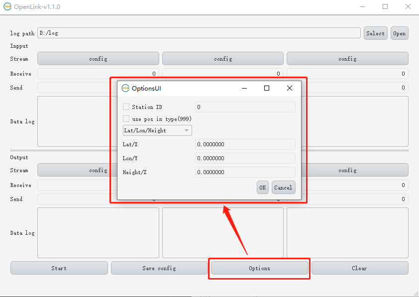
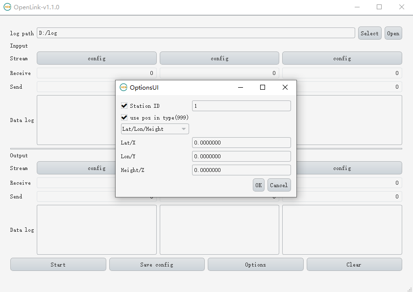
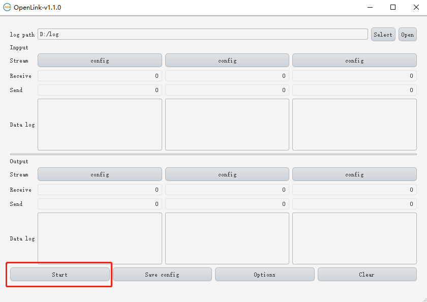

# 如何将openrtk作为基站使用

Openlink下载地址：<https://github.com/Aceinna/openrtk_core/releases>

选择一个目录用来存放日志。

将 openrtk330 模块连接串口，点击 Input Stream 第一个位置的 config 按钮打开配置对话框。

 
勾选 Input-1，Stream 选择 Serial Port ，Port 选择第二个串口，Bitrate 选择460800，完成后点击 OK 按钮。

点击 Output Stream 第一个位置的 config 按钮打开配置对话框。

勾选 Output-1，Stream 选择 Ntrip Client/Caster ，分别配置ip、port和mountpiont等，完成后点击 OK 按钮。

点击Options打开站点配置窗口。

勾选 Station ID 填写站id，输入经纬高或者XYZ，如果勾选use pos in(999)将不使用输入的位置，从类型999数据中读取位置。

点击start开始作为基站上传数据。

