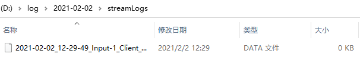

[English](README-En.md)

# Openlink 使用说明

OpenLink一款用来转发和保存数据的工具软件。它可以在任意输入流和输出流之间互相连接，并且可以保存任意一个流的数据。【Input-1】【Input-2】【Input-3】收到的数据可以任意转发给【Output-1】【Output-2】【Output-3】，【Output-1】【Output-2】【Output-3】收到的数据也可以任意转发给【Input-1】【Input-2】【Input-3】。

Openlink下载地址：<https://github.com/Aceinna/openrtk_core/releases>

## 1. 使用Openlink保存Ntrip数据

1.1. 点击【Select】选择一个目录用来保存文件。

1.2. 勾选【Input-1】,并且点击下方的【config】按钮，打开【Input-1】的数据流配置对话框。

1.3. 在【Input-1】对话框中，【Stream】选择为【Ntrip Client】，并且填写相应的参数，勾选【Logfile】，完成后点击 OK 按钮。

1.4. 点击【start】按钮开始采集数据。

1.5. 【format】选择hex可以看到收到数据的16进制形式的表示，点击【Open】按钮可以在资源管理器中找到数据文件。

1.6. 资源管理器找到刚刚保存的数据文件。

1.7. 其他数据流采集数据配置方式相同，6个数据流可以同时采集数据，勾选相应数据流表示开启该数据流。

1.8. 打开资源管理器可以看到保存的数据文件。

## 2.使用Openlink保存串口数据

2.1. 其他步骤与保存Ntrip数据相同 1.3. 步骤中选择【Serial Port】，选择相应的【port】、【Bitrate】和【ByteSize】。

2.2. 点击【start】即可以采集串口数据。

2.3. 同样6个数据流可以连接6个串口同时采集数据，也可以同时采集Ntrip和串口数据。

2.4. 打开资源管理器可以看到保存的数据文件。

## 3.使用Openlink转发数据

3.1. 勾选【Input-1】并且配置【Input-1】为 【Ntrip client】，【Link】勾选【Output-1】数据将会转发到【Output-1】的数据流，如果需要也可以勾选其他【Output】转发到多个数据流，如果需要保存【Ntrip client】接收到的数据可以勾选【Logfile】。

3.2. 勾选【Output-1】并且配置【Output-1】为 【Serial Port】，选择相应的【port】、【Bitrate】和【ByteSize】。

3.3. 点击【start】即可以转发数据。

3.4. 同理也可以将【Serial Port】的数据转发到【Ntrip Caster】上，【Input-1】选择【Serial Port】,【Link】勾选【Output-1】。

3.5. 【Output-1】选择【Ntrip Caster】。

3.6. 点击【start】即将【Serial Port】转发到【Ntrip Caster】上。

3.7. 可以看到新的Caster已经建立。

3.8. 其他的输入输出流同样可以如此使用。

## 4.使用Openlink架设基站

4.1. 与转发数据的方式相同，【Input-1】选择【Serial Port】,选择输出RTCM的串口，【Link】勾选【Output-1】。

4.2. 【Output-1】选择【Ntrip Caster】。

4.3. 点击【Option】按钮打开【Option】对话框

4.4. 勾选【Station Id】并且输入Id，选择站点坐标的格式并且输入坐标，点击【OK】关闭对话框。

4.5. 点击【start】上传数据到【Ntrip Caster】上，建立站点。

4.6. 在网站页面上查看新建立的基站。

## 5.使用Openlink读取文件
