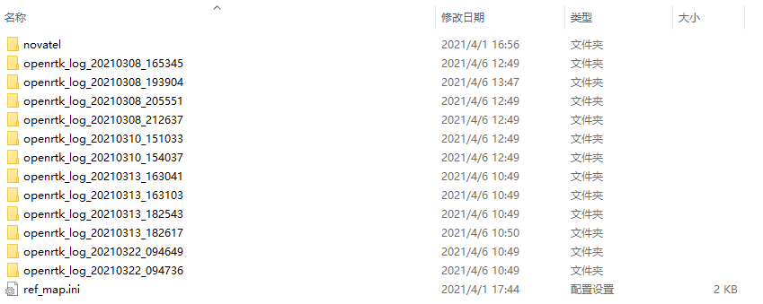
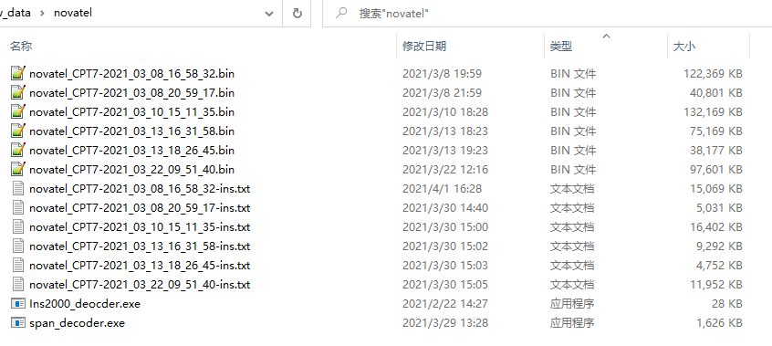
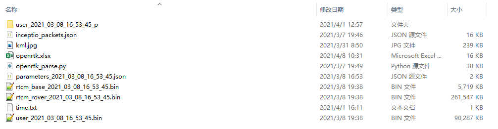
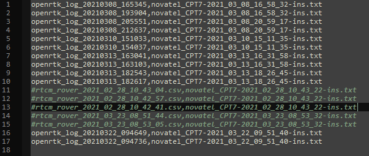
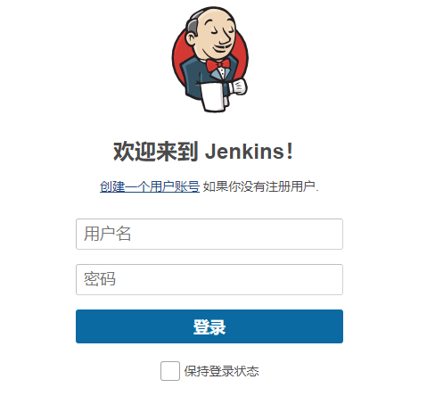
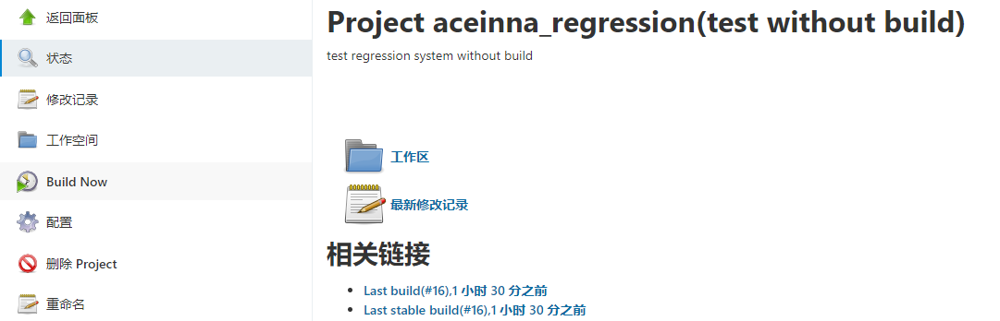
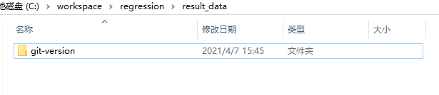

# Add test data to the regression system

1. Remote login

   Ip：192.168.20.40

   user：rd

   Raw data directory：

   ```
   c:\\workspace\regression\raw_data\
   ```

   
2. To put the novatel reference data in the novatel folder, you just need to decode it to *ins.txt file.

   
3. Under the raw data folder, the following files are required. 
   * The kml.jpg is test Roadmap;
   * The time.txt is the time file used for INS analysis;
   * The openrtk.xlsx is a description of this test;
   * The folder user_YYYY_mm_dd_hh_MM_ss_p is decoded from file user_YYYY_mm_dd_hh_MM_ss.bin.

   
4. Fill in the mapping relationship between the original data and the reference file in the ref_map.ini file. You can annotate the mapping with a '#' or ';' sign at the beginning of each line.

   
</br>
</br>

# How to update the executable file of RTK or INS manually

1. Copy the RTK or ins file to the executable directory. Executable Directory:

   ```
   c:\\workspace\regression\bin\
   ```

   
2. Modify git in the directory- version.json File, fill in the corresponding version number.

   
</br>
</br>

# Run the regeneration system

1. Browser open http://192.168.20.40 : 8080 / log in or create an account.

   
2. After login, click aceinna_regression(test without build)。

   
3. Click build now to run.

   
</br>
</br>

# Access to reports

1. Open the result set directory on the server and enter the corresponding version of the result set folder.

   ```
   C:\workspace\regression\result_data
   ```
   
2. The PDF file is the summary report.

   
3. The PDF file contained in each data result folder is a report of a single data result.

   
