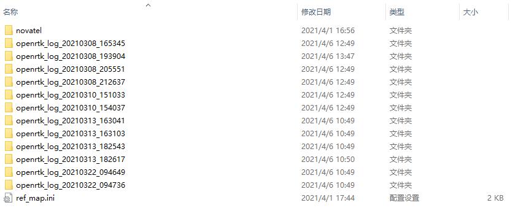
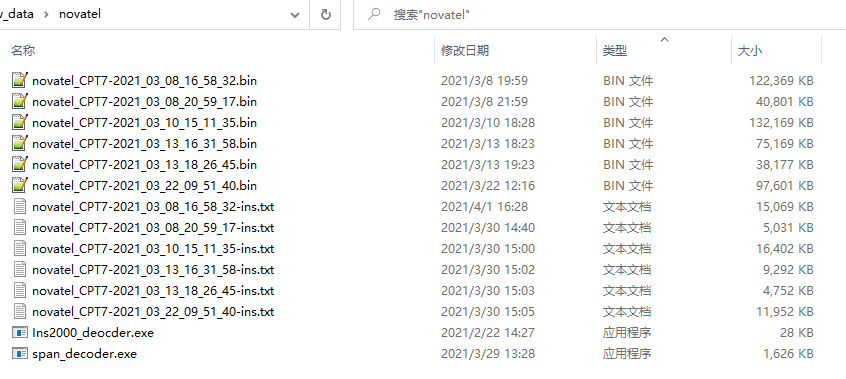
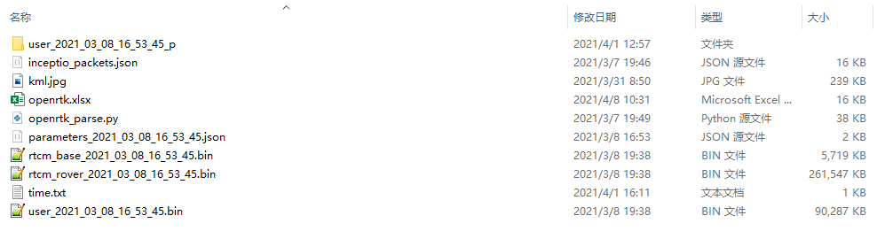
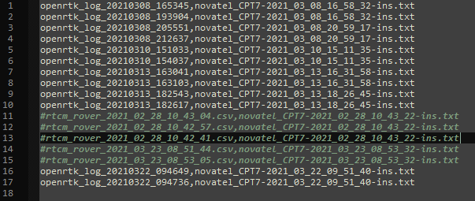
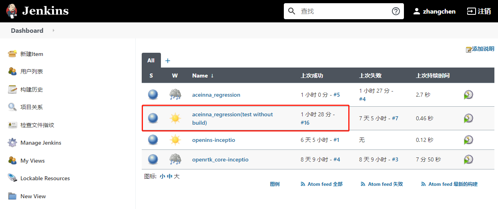
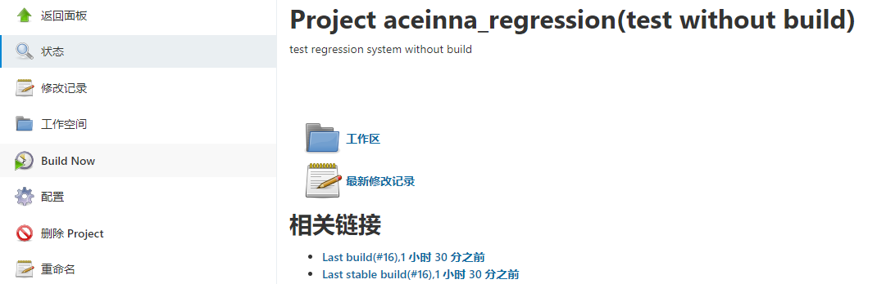
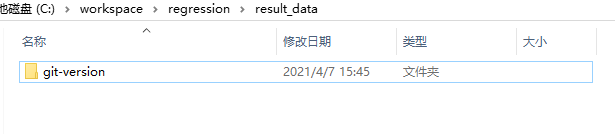
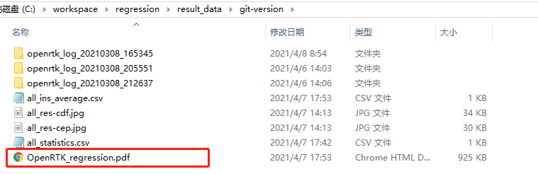
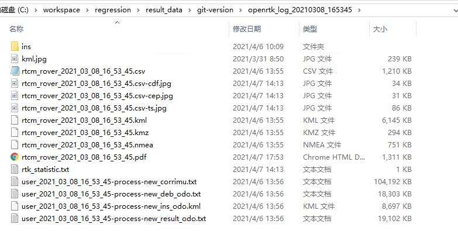

# 如何向Regression系统中添加测试数据。

1. 远程登录

    服务器：192.168.20.40

    用户名：rd

    原始数据目录：
    ```
    c:\\workspace\regression\raw_data\
    ```
    

2. novatel参考数据放在novatel文件夹中，只需要解码好*-ins.txt文件。

    

3. 原始数据文件夹下，需要以下文件，其中kml.jpg是测试线路图，time.txt是ins分析用的时间文件，openrtk.xlsx是本次测试相关的描述，user_2021_03_22_09_47_36_p文件夹下是从user_2021_03_22_09_47_36.bin文件中解码的数据。

    

4. ref_map.ini中填写，原始数据和参考文件的映射关系，在行开头使用'#'或者';'号可注释该条映射。

    

# 如何运行Regression系统。

1. 浏览器打开 http://192.168.20.40:8080/ 登录或者创建一个账号。

    

2. 登录后点击aceinna_regression(test without build)。

    

3. 点击Build Now运行。

    

# 获取报告

1. 在服务器上打开结果集目录，进入相应版本的结果集文件夹中。
    ```
    C:\workspace\regression\result_data
    ```
    
    
2. 其中的pdf文件为汇总报告。

    

2. 每个数据结果文件夹中，包含的pdf文件为单个数据结果的报告。

    