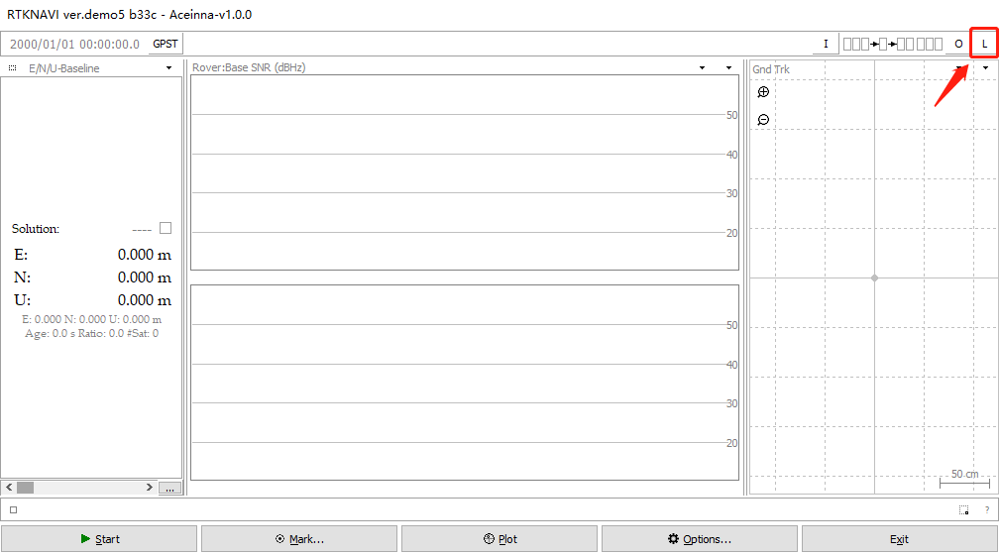
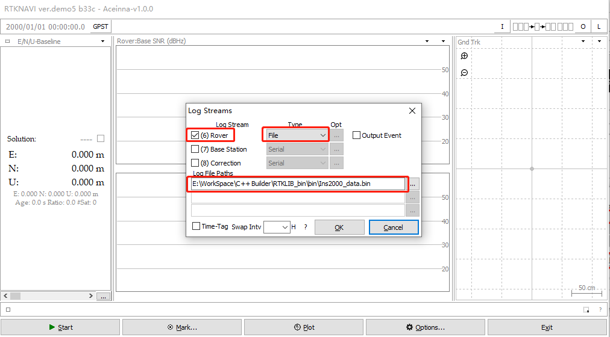

[中文](README.md)
# Description of ins2000 data collected by rtknavi
rtknavi.exe download: <https://github.com/Aceinna/rtklib_aceinna/releases>

## 1. Using rtknavi to save ins2000 data and decode at the same time

1.1. Click the [i] button in the upper right corner to open the [input streams] dialog box.

1.2. Check [(1) Rover], select [serial] for [type], select [ins2000] for [format], and click [Opt] to open the [serial options] dialog box.

1.3. [port] select the serial port of ins2000, and [bitrate] select 460800. Click [OK] to close the dialog box.

1.4. Click the [l] button in the upper right corner to open the [log streams] dialog box.

1.5. Check [(6) Rover], [type] select [file], and then select a path to save the file, and click [OK] to close the dialog box.

1.6. Click [start] to start data collection.

1.7. Collect data and decode the generated files in real time.

