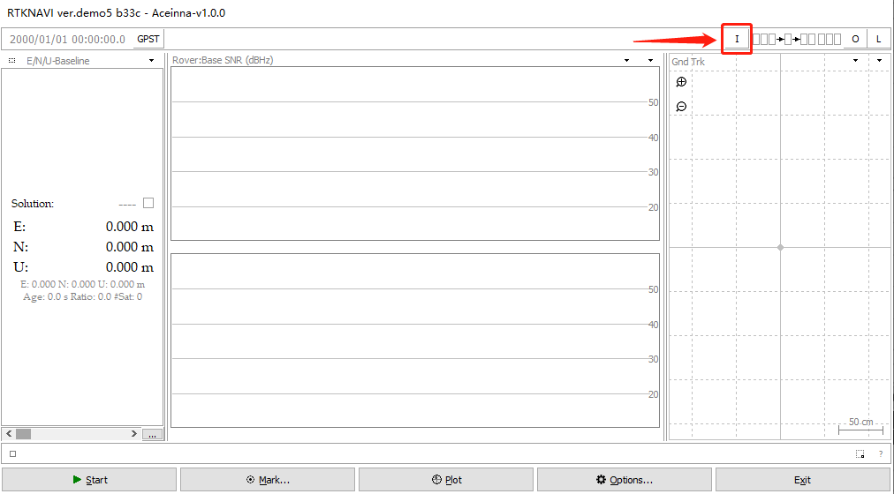
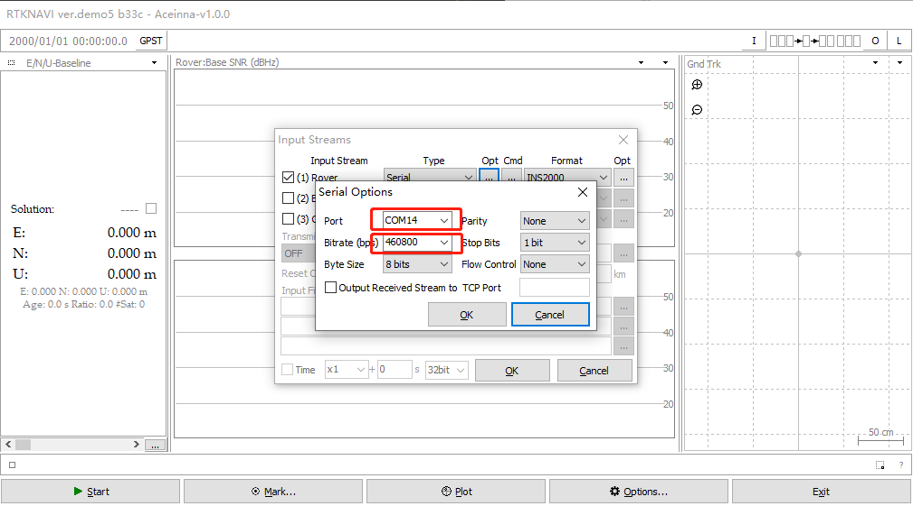

[中文](README.md)
# Description of ins2000 data collected by rtknavi
rtknavi.exe download: <https://github.com/Aceinna/rtklib_aceinna/releases>

## 1. Using rtknavi to save ins2000 data and decode at the same time

1.1. Click the [i] button in the upper right corner to open the [input streams] dialog box.



1.2. Check [(1) Rover], select [serial] for [type], select [ins2000] for [format], and click [Opt] to open the [serial options] dialog box.


1.3. [port] select the serial port of ins2000, and [bitrate] select 460800. Click [OK] to close the dialog box.



1.4. Click the [CMD] button to open the [serial / TCP commands] dialog box.


1.5. Check [commands at startup] in the [serial / TCP commands] dialog box and output configuration parameters in the text box.
```
unlogall
NTRIPCONFIG NCOM1 client V1 47.116.1.17:2201 WX02 AceinnaRTK SIGEMZOOMQ1JDJI3
SETINSTRANSLATION ANT1 -0.28 1.43 1.0 0.20 0.20 0.20
SETINSTRANSLATION DUALANT 0.7 0.0 0.0 0.20 0.20 0.20
SETINSROTATION RBV 0.0 0.0 0.0 0.5 0.5 1.0
SETINSTRANSLATION USER -0.28 1.43 1.0 0.20 0.20 0.20
INSCOMMAND ENABLE
LOG RANGECMPB ONTIME 1
LOG RAWEPHEMB ONCHANGED
LOG GLOEPHEMERISB ONCHANGED
LOG GALEPHEMERISB ONCHANGED
LOG BDSEPHEMERISB ONCHANGED
LOG QZSSEPHEMERISB ONCHANGED
LOG INSCONFIGB ONCHANGED
LOG versionb once
LOG rxstatusb once
LOG inspvaxb ontime 0.1
LOG bestgnssposb ontime 0.1
LOG bestgnssvelb ontime 0.1
LOG headingb ontime 0.1
LOG heading2b ontime 1
LOG RAWIMUSXB ONNEW
LOG gpgga ontime 0.1
LOG NCOM1 gpgga ontime 1
SAVECONFIG
```


1.6. Click the [l] button in the upper right corner to open the [log streams] dialog box.


1.7. Check [(6) Rover], [type] select [file], and then select a path to save the file, and click [OK] to close the dialog box.


1.8. Click [start] to start data collection.


1.9. Collect data and decode the generated files in real time.

