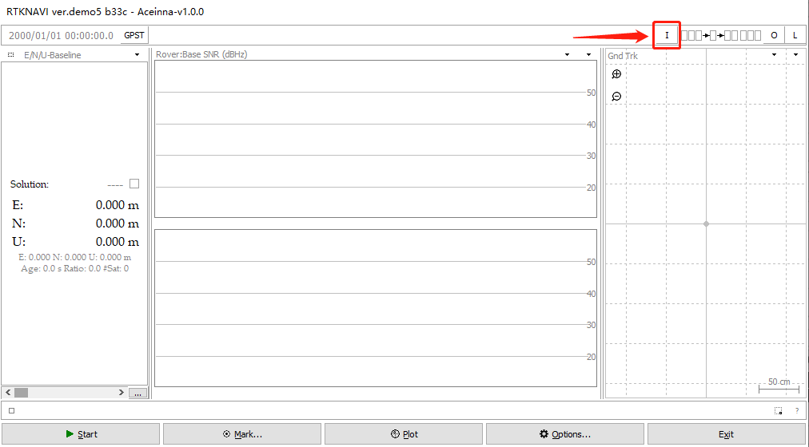
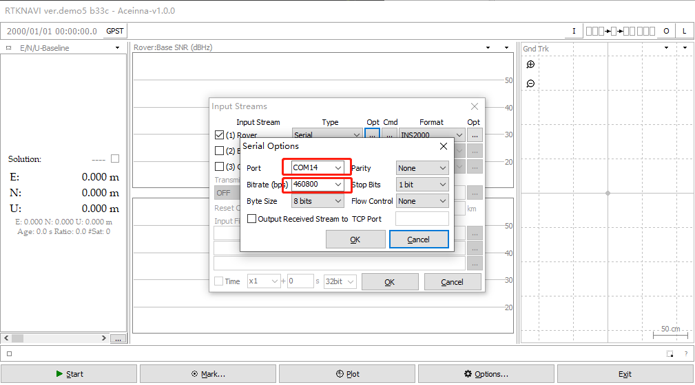
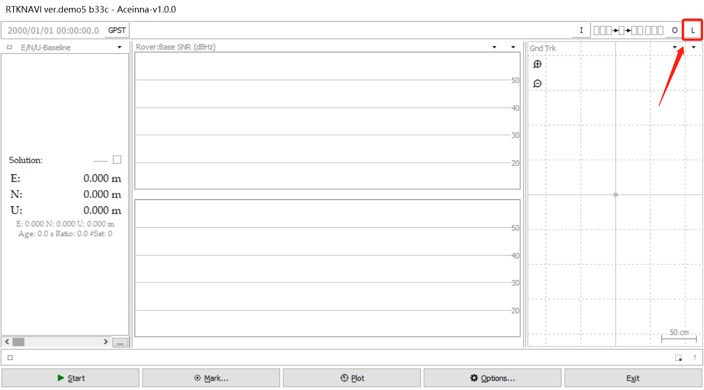
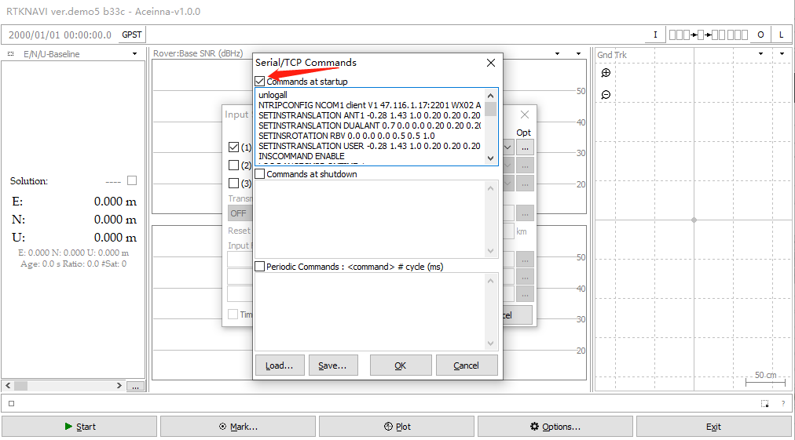
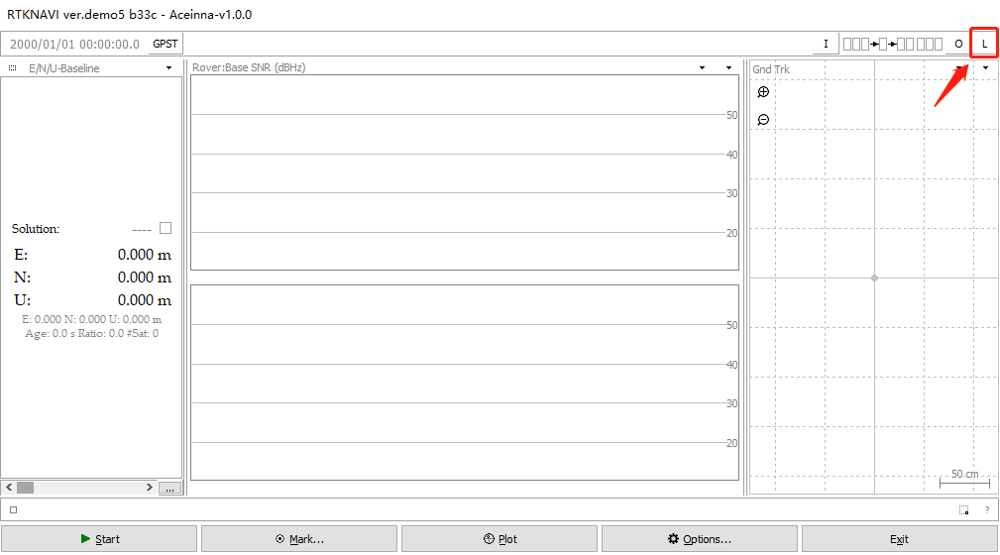
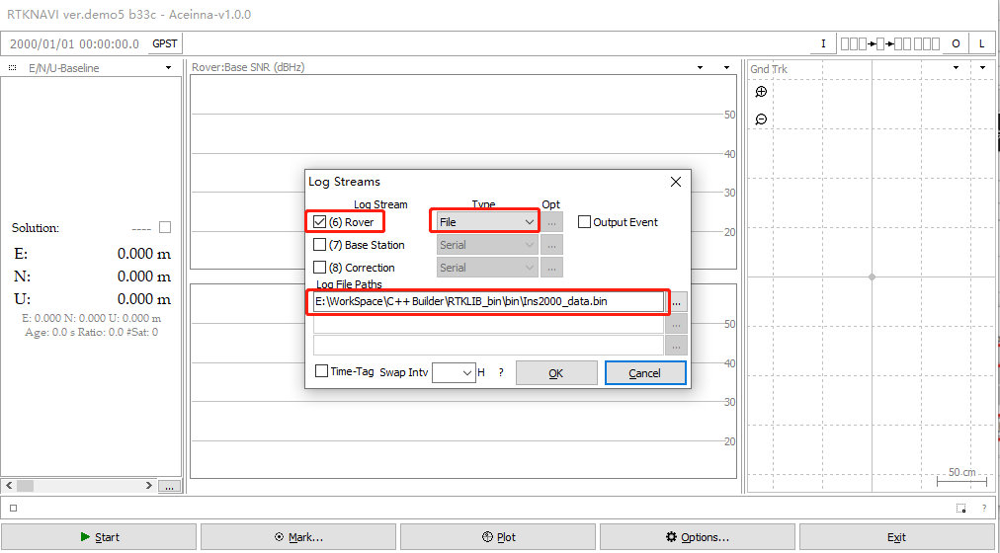

[English](README-En.md)
# RtkNavi 采集Ins2000数据说明
rtknavi.exe 下载地址：<https://github.com/Aceinna/rtklib_aceinna/releases>

## 1. 使用rtknavi保存Ins2000数据同时解码

1.1. 点击右上角的【I】按钮打开【Input Streams】对话框。

1.2. 勾选【(1)Rover】,并且【Type】选择【Serial】，【Format】选择【INS2000】，点击【Opt】按键打开【Serial Options】对话框。

1.3. 【Port】选择Ins2000的串口，【Bitrate】选择460800，点击【OK】关闭对话框。

1.4. 点击右上角的【L】按钮打开【Log Streams】对话框。

1.5. 勾选【(6)rover】, 【type】选择【File】，然后选择一个保存文件路径，点击【OK】关闭对话框。

1.6. 点击【start】开始采集数据。

1.7. 采集数据的数据同时实时解码产生的文件。

