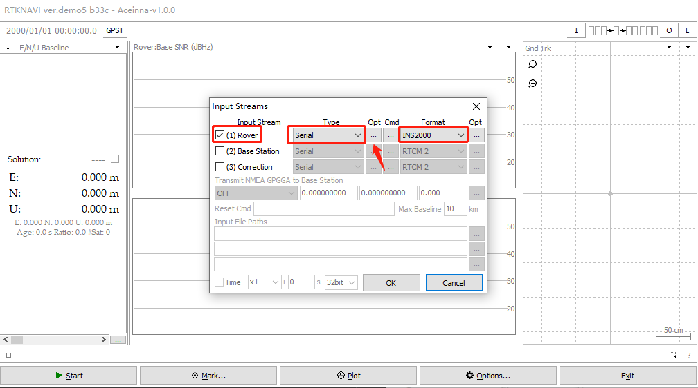
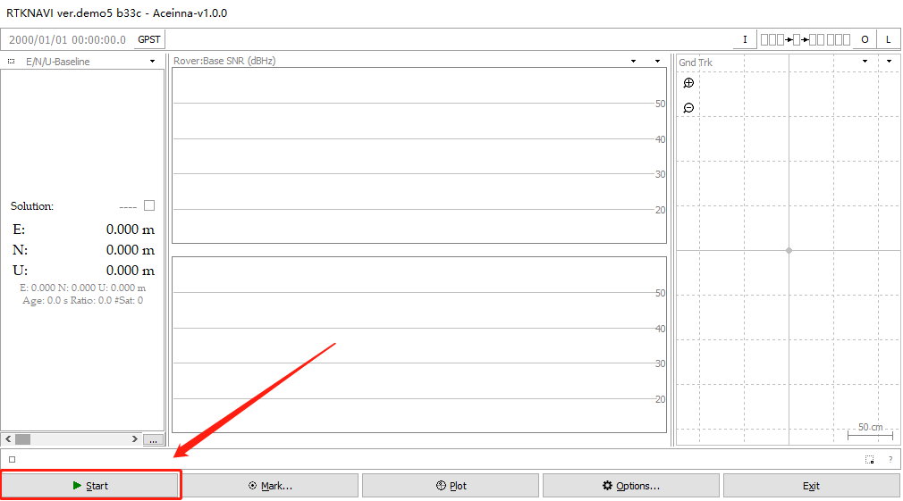
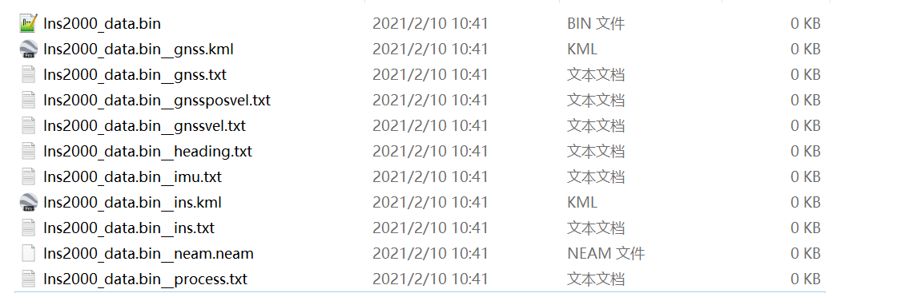

[English](README-En.md)
# RtkNavi 采集Ins2000数据说明
rtknavi.exe 下载地址：<https://github.com/Aceinna/rtklib_aceinna/releases>

## 1. 使用rtknavi保存Ins2000数据同时解码

1.1. 点击右上角的【I】按钮打开【Input Streams】对话框。


1.2. 勾选【(1)Rover】,并且【Type】选择【Serial】，【Format】选择【INS2000】，点击【Opt】按键打开【Serial Options】对话框。



1.3. 【Port】选择Ins2000的串口，【Bitrate】选择460800，点击【OK】关闭对话框。


1.4. 点击【Cmd】按钮，打开【Serial/TCP Commands】对话框。


1.5. 在【Serial/TCP Commands】对话框中勾选【commands at startup】，在文本框中输出配置参数。
```
unlogall
NTRIPCONFIG NCOM1 client V1 47.116.1.17:2201 WX02 AceinnaRTK SIGEMZOOMQ1JDJI3
SETINSTRANSLATION ANT1 -0.28 1.43 1.0 0.20 0.20 0.20
SETINSTRANSLATION DUALANT 0.7 0.0 0.0 0.20 0.20 0.20
SETINSROTATION RBV 0.0 0.0 0.0 0.5 0.5 1.0
SETINSTRANSLATION USER -0.28 1.43 1.0 0.20 0.20 0.20
INSCOMMAND ENABLE
LOG RANGECMPB ONTIME 1
LOG RAWEPHEMB ONCHANGED
LOG GLOEPHEMERISB ONCHANGED
LOG GALEPHEMERISB ONCHANGED
LOG BDSEPHEMERISB ONCHANGED
LOG QZSSEPHEMERISB ONCHANGED
LOG INSCONFIGB ONCHANGED
LOG versionb once
LOG rxstatusb once
LOG inspvaxb ontime 0.1
LOG bestgnssposb ontime 0.1
LOG bestgnssvelb ontime 0.1
LOG headingb ontime 0.1
LOG heading2b ontime 1
LOG RAWIMUSXB ONNEW
LOG gpgga ontime 0.1
LOG NCOM1 gpgga ontime 1
SAVECONFIG
```


1.6. 点击右上角的【L】按钮打开【Log Streams】对话框。


1.7. 勾选【(6)rover】, 【type】选择【File】，然后选择一个保存文件路径，点击【OK】关闭对话框。


1.8. 点击【start】开始采集数据。



1.9. 采集数据的数据同时实时解码产生的文件。

